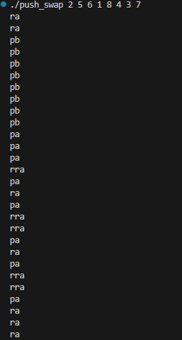
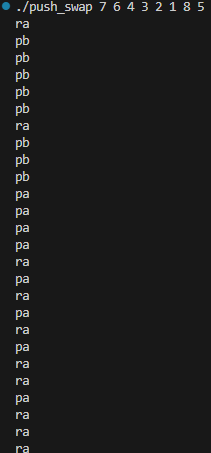
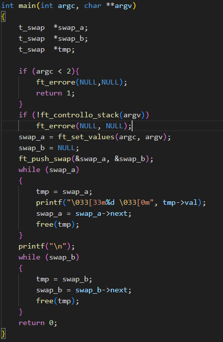

# Push_Swap


## Introduction
This is a project that asks us to create a sorting algorithm.

Through specific moves :

- ``` sa ```  (swap a): Swap the first 2 elements at the top of stack a. Do nothing if there is only one or no elements.

- ``` sb ```  (swap b): Swap the first 2 elements at the top of stack b. Do nothing if there is only one or no elements.

- ```ss```  sa and sb at the same time.
- ```pa``` (push a): Take the first element at the top of b and put it at the top of a. Do nothing if b is empty.

- ```pb``` (push b): Take the first element at the top of a and put it at the top of b. Do nothing if a is empty.
- ```ra``` (rotate a): Shift up all elements of stack a by 1. The first element becomes the last one.
- ```rb```  (rotate b): Shift up all elements of stack b by 1. The first element becomes the last one.
- ```rr``` ra and rb at the same time.
- ```rra``` a (reverse rotate a): Shift down all elements of stack a by 1. The last element becomes the first one.
- ```rrb```  (reverse rotate b): Shift down all elements of stack b by 1. The last element becomes the first one.
- ```rrr``` rra and rrb at the same time.

# [Subject](./Docks/subject/push_swap.subject.pdf)

 

# Testing

If you want to see that my sort worked.

Enter the folder where the main.c file is located and add this printf to main:
```c
printf("\033[33m%d \033[0m", tmp->val);
```


This stack to your liking: ```2 10 100 1000 1 3 5 6```

Open the terminal:
```bash
make
./push_swap 2 10 100 1000 1 3 5 6
```